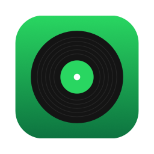
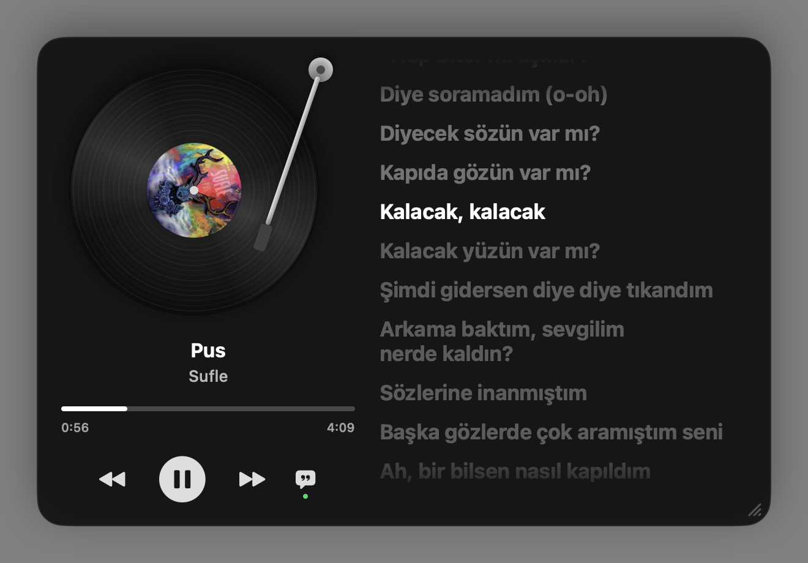
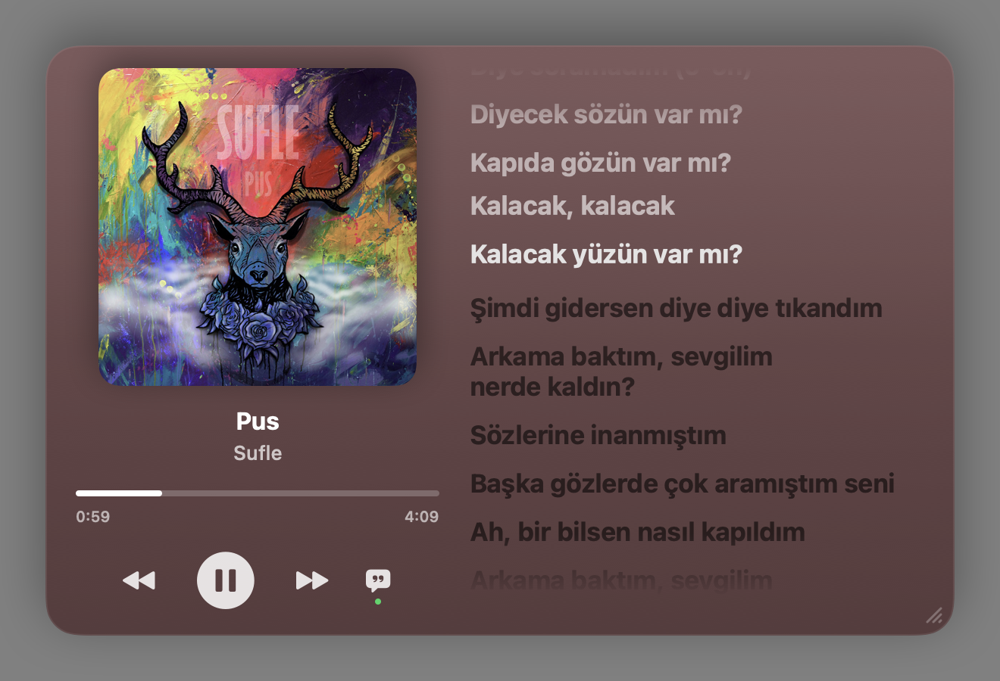
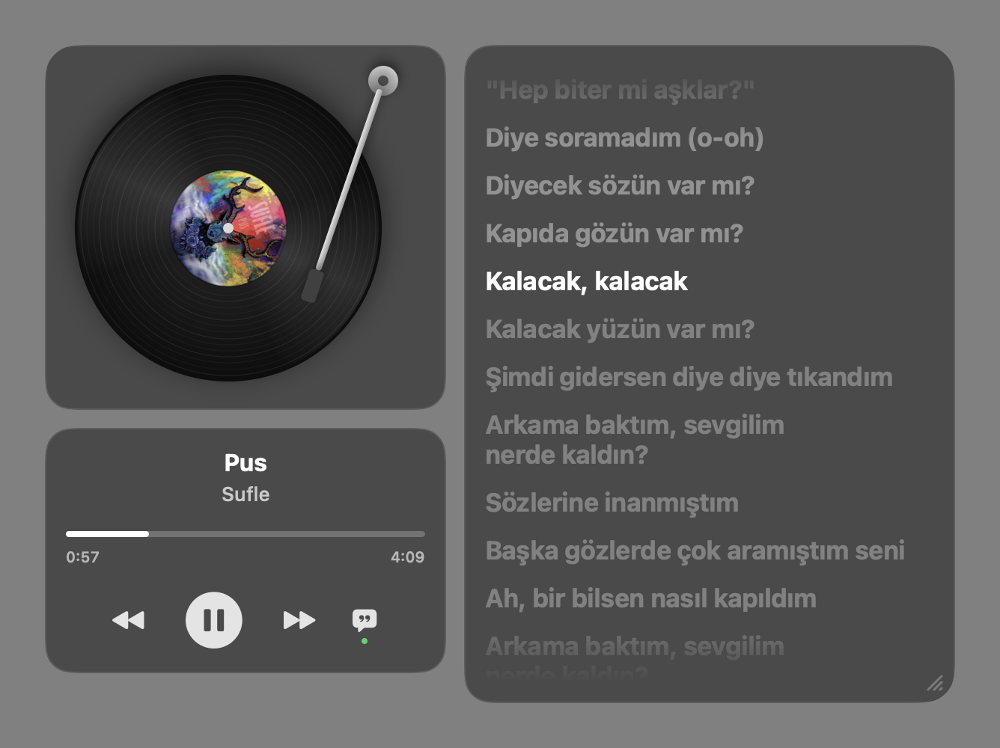
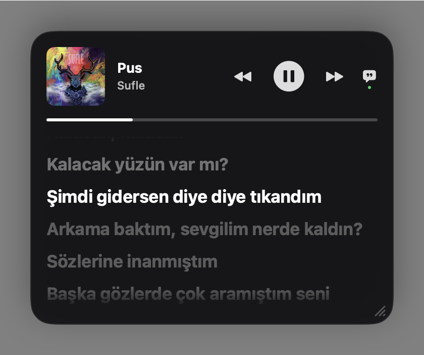

<p align="center">
  
</p>

<h1 align="center">Mate Lyrics</h1>

<p align="center">
  Spotify'da çalan şarkıyı macOS masaüstünde gösteren, senkron şarkı sözlü widget.<br>
  <i>A macOS desktop widget for the song playing in Spotify, with synced lyrics.</i>
</p>

<p align="center">
  
</p>

## Özellikler

- **3 görünüm:** Plak (dönen plak + iğne), Kapak, Kompakt
- **Senkron şarkı sözleri:** Spotify tarzı, söylenen satır vurgulanır; satıra tıklayınca oraya atlar
- **4 arka plan:** kapak rengi, cam, koyu, şeffaf (ayrı kutular)
- **Tek tuşla sözleri aç/kapa**, oynat/durdur, ileri/geri, ilerleme çubuğundan atlama
- **Köşeden sürükleyerek boyutlandırma**, istediğin yere taşıma (konum hatırlanır), **konum kilidi**
- Sözleri **iki parmakla kaydırma** (3 sn sonra çalan satıra döner)
- Kapağa / plağa tıklayınca **Spotify öne gelir** (sayfa değiştirmeden)
- Masaüstüne sabitleme (pencerelerin arkasında) veya her zaman üstte
- Şarkı bazında söz zamanlaması ince ayarı
- Menü çubuğu uygulaması, Dock'ta yer kaplamaz; girişte otomatik başlatma

| Kapak | Şeffaf | Kompakt |
|---|---|---|
|  |  |  |

## Kurulum

1. [Releases](../../releases) sayfasından `Mate-Lyrics.zip` dosyasını indir, aç ve **Mate Lyrics**'i Uygulamalar klasörüne sürükle.
2. Uygulama Apple tarafından imzalanmadığı için ilk açılışta macOS uyarı verir:
   **Sistem Ayarları › Gizlilik ve Güvenlik › "Yine de Aç"**. Ya da Terminal'de:
   ```bash
   xattr -dr com.apple.quarantine "/Applications/Mate Lyrics.app"
   ```
3. "Mate Lyrics, Spotify'ı denetlemek istiyor" sorusuna **İzin Ver** de.

**Gereksinimler:** macOS 14 (Sonoma) veya üstü, Spotify masaüstü uygulaması. Apple Silicon ve Intel.

## Kullanım

- Ayarlar: menü çubuğundaki ♫ ikonu ya da widget'a sağ tık.
- Boyutlandırma: widget'ın sağ alt köşesinden sürükle.
- Sözler kayıksa: sağ tık › **Söz zamanlaması (bu şarkı)** ile 0,25 sn adımlarla düzelt.

## Kaynaktan derleme

```bash
git clone https://github.com/Farukzbek/mate-lyrics.git
cd mate-lyrics
./build-app.sh        # dist/Mate Lyrics.app + dist/Mate-Lyrics.zip
```

Xcode komut satırı araçları yeterli (Swift 5.9+). Geliştirme için:

| Komut | Ne yapar |
|---|---|
| `.build/debug/MateLyrics --snapshot <klasör>` | Her görünümü PNG olarak kaydeder |
| `.build/release/MateLyrics --bench` | Söz satırı değişiminin maliyetini ölçer |
| `.build/debug/MateLyrics --test-drag` | Taşıma/boyutlandırmayı sahte fare olaylarıyla dener |

## Nasıl çalışıyor?

- Çalan şarkı Spotify'dan **AppleScript** ile okunur (API anahtarı ya da giriş gerekmez).
- Şarkı sözleri topluluk tarafından oluşturulan ücretsiz [LRCLIB](https://lrclib.net) veritabanından gelir; her şarkıda bulunmayabilir.
- Tamamen SwiftUI + AppKit, harici bağımlılık yok.

---

## English

Mate Lyrics shows the track currently playing in Spotify as a desktop widget on macOS, with Spotify-style synced lyrics.

- Three styles (vinyl, cover, compact), four backgrounds, resize from the corner, pin to desktop
- Synced lyrics from [LRCLIB](https://lrclib.net); click a line to seek; per-song timing offset
- Download from [Releases](../../releases), move to Applications, then allow it in **System Settings › Privacy & Security** (the app is not notarized) and allow Spotify automation when asked
- Requires macOS 14+ and the Spotify desktop app. Build with `./build-app.sh`

## Yasal not / Disclaimer

Bu proje Spotify ile bağlantılı değildir ve Spotify tarafından onaylanmamıştır. Spotify, Spotify AB'nin ticari markasıdır.
Şarkı sözlerinin ve albüm kapaklarının hakları sahiplerine aittir; uygulama bunları yalnızca kişisel kullanım için gösterir.

*Not affiliated with or endorsed by Spotify. Lyrics and artwork belong to their respective owners.*

## Lisans

[MIT](LICENSE)
